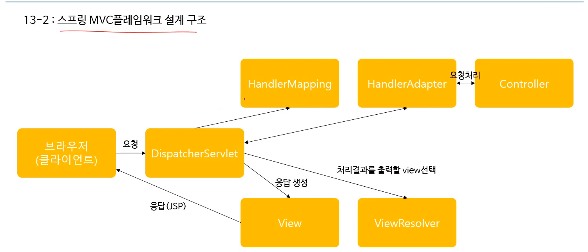
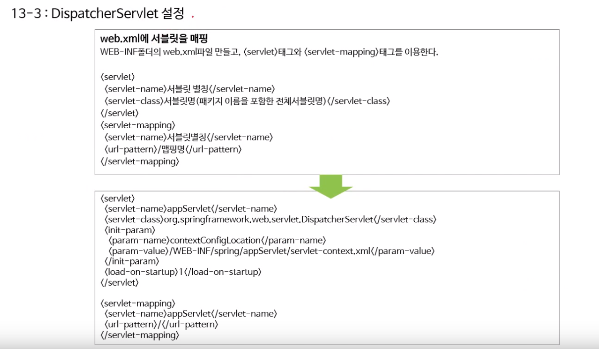
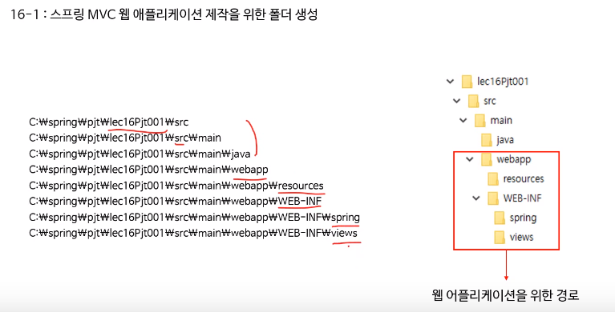
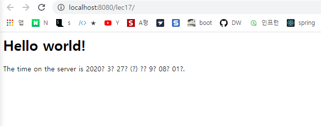
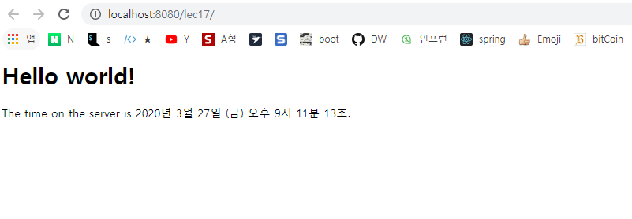

## 🚩 Spring 개념잡기               start _ 2020-03-17


##### 자바 스프링 프레임워크(renew ver.) - 신입 프로그래머를 위한 강좌

인프런 스프링 기초 개념 강좌를 수강하며 실습하는 파일들을 기록하는 Repository 입니다.


## :heavy_check_mark: 4강 ( pom.xml 정의, applicationContext, Bean )

### 1. 기본 프로젝트 생성

​	1-1 기본 Maven 프로젝트 생성 ( new -> Maven Project )


​	1-2 pom.xml 작성


```java
<project xmlns="http://maven.apache.org/POM/4.0.0" xmlns:xsi="http://www.w3.org/2001/XMLSchema-instance" xsi:schemaLocation="http://maven.apache.org/POM/4.0.0 http://maven.apache.org/xsd/maven-4.0.0.xsd">
  <modelVersion>4.0.0</modelVersion>
  <groupId>spring4</groupId>
  <artifactId>testPjt</artifactId>
  <version>0.0.1-SNAPSHOT</version>
  
  	<dependencies>
		<dependency>
			<groupId>org.springframework</groupId>
			<artifactId>spring-context</artifactId>
			<version>4.1.0.RELEASE</version>
		</dependency>
	</dependencies>

	<build>
		<plugins>
			<plugin>
				<artifactId>maven-compiler-plugin</artifactId>
				<version>3.1</version>
				<configuration>
					<source>1.8</source>
					<target>1.8</target>
					<encoding>utf-8</encoding>
				</configuration>
			</plugin>
		</plugins>
	</build>
  
</project>
```


이곳에서 기본 pom.xml파일에 

두 가지,  spring-context와 maven-compiler-plugin을 추가해주었다.


:soon:   plugin을 추가해준 뒤 [ Maven -> Update Project ] 를 진행해준다.

:soon:  ​ 가장 기본의 Maven 프로젝트 src/main/ java와 resources 생성되며

:soon:   이후 테스트에 사용할 src/test/ java와 resources 생성된다.


java 폴더는 JAVA 파일들이 위치하는 곳이고 

​	resources 는 자원을 관리하는 폴더로 스프링 설정 파일(XML) 또는 프로퍼티 파일 등을 관리


### 2. applicationContext.xml 작성


```java
<?xml version="1.0" encoding="UTF-8"?>

<beans xmlns="http://www.springframework.org/schema/beans"
       xmlns:xsi="http://www.w3.org/2001/XMLSchema-instance"
       xsi:schemaLocation="http://www.springframework.org/schema/beans
	   http://www.springframework.org/schema/beans/spring-beans-3.1.xsd">
	
		<bean id="tWalk" class="testPjt.TransportationWalk"/>
	   	
</beans>

```


Spring에서 **bean**을 사용해보기 위해 testPjt.TransportationWalk 클래스를 "tWalk" 빈 지정

-->	이후 Main에서 사용해보았다.


```java
package testPjt;

import org.springframework.context.support.GenericXmlApplicationContext;

public class MainClass {

	public static void main(String[] args) {
	
//		### applicationContext와 bean을 사용하지 않은 경우 ###
//		TransportationWalk transportationwalk = new TransportationWalk();
//		transportationwalk.move();
		
		
//		### bean과 applicationContext를 사용한 경우
		GenericXmlApplicationContext ctx = new GenericXmlApplicationContext("classpath:applicationContext.xml");
		TransportationWalk transportationWalk = ctx.getBean("tWalk", TransportationWalk.class);
		transportationWalk.move();
		
		ctx.close();
	}
}
```


## :heavy_check_mark: 6강 ( DI_Dependency Injection )


### * applicationContext Bean

Spring에서 Bean을 생성하고 이용하기 위해서 applicationContext파일을 사용했다.

여기에서 Bean을 생성할 때, Dao를 하나 생성한다면


```
<bean id="studentDao" class="ems.member.dao.StudentDao"></bean>
```

이런식으로 생성해줄 수 있을 것이다.


이제 이 studentDao를 사용하는 registerService 또는 modifyService와 같이

Dao객체를 이용할 때에는 < constructor-arg> 를 사용한다.


```

<bean id="registerService" class="ems.member.service.StudentRegisterService">
	<constructor-arg ref="studentDao"></constructor-arg>
</bean>

<bean id="modifyService" class="ems.member.service.StudentModifyService">
	<constructor-arg ref="studentDao"></constructor-arg>
</bean>

```


## 다양한 의존성 객체 주입 방법

#### 1. 생성자를 이용한 객체 주입


public StudentRegisterService(StudentDao studentDao) {

​	this.studentDao = studentDao;

}


```java
# applicationContext.xml...
<bean id="studentDao" class="ems.member.dao.StudentDao"></bean>

<bean id="registerService" class="ems.member.service.StudentRegisterService">
	<constructor-arg ref="studentDao"></constructor-arg>
</bean>
```


```java
# Main에서...
GenericXmlApplicationContext ctx = new GenericXmlApplicationContext("classpath:applicationContext.xml");

StudentRegisterService registerService = ctx.getBean("registerService, StudentRegisterService.class")
```


## :heavy_check_mark: 9강 ( 의존 객체 자동 주입 )


#### 의존 객체 자동 주입이란 ?

```
스프링 설정 파일에서 의존 객체를 주입할 때 <constroctor-org> 또는 <property> 태그로 의존 대상 객체를 명시하지 않아도 스프링 컨테이너가 자동으로 필요한 의존 대상 객체를 찾아서 의존 대상 객체가 필요한 객체에 주입해 주는 기능이다.

구현 방법은 @Autowired와 @Resource 어노테이션을 이용해서 쉽게 구현할 수 있다.
```


### @Autowired

- 주입하려고 하는 **객체의 타입이 일치**하는 객체를 자동으로 주입한다.


@Autowired로 의존 객체를 주입시켜주기 위해 xml 파일을 수정한다.


<context:annotation-config /> 코드 추가,  <beans>코드 조금 추가

```java
						[ 기존의 xml 파일 ]

<?xml version="1.0" encoding="UTF-8"?>

<beans xmlns="http://www.springframework.org/schema/beans"
	xmlns:xsi="http://www.w3.org/2001/XMLSchema-instance"
	xsi:schemaLocation="http://www.springframework.org/schema/beans 
 		http://www.springframework.org/schema/beans/spring-beans.xsd">

	<bean id="wordDao" class="com.word.dao.WordDao" />
	
	<bean id="registerService" class="com.word.service.WordRegisterService">
		<constructor-arg ref="wordDao" />
	</bean>
	
	<bean id="searchService" class="com.word.service.WordSearchService">
		<constructor-arg ref="wordDao" />
	</bean>
	
</beans>
```


@Autowired 를 사용하기 위해 변경된 xml

```java
				[ annotation-config태그 추가, constructor 제거 ]

<?xml version="1.0" encoding="UTF-8"?>

<beans xmlns="http://www.springframework.org/schema/beans"
	xmlns:context="http://www.springframework.org/schema/context"
	xmlns:xsi="http://www.w3.org/2001/XMLSchema-instance"
	xsi:schemaLocation="http://www.springframework.org/schema/beans 
 		http://www.springframework.org/schema/beans/spring-beans.xsd 
 		http://www.springframework.org/schema/context 
 		http://www.springframework.org/schema/context/spring-context.xsd">

	<context:annotation-config />

	<bean id="wordDao" class="com.word.dao.WordDao" >
	</bean>
	
	<bean id="registerService" class="com.word.service.WordRegisterServiceUseAutowired" />
	
	<bean id="searchService" class="com.word.service.WordSearchServiceUseAutowired" />
	
</beans>
```


@Autowired를 적용한 Service 예시

```java
package com.word.service;

import com.word.WordSet;
import com.word.dao.WordDao;

public class WordRegisterService {

	private WordDao wordDao;
	
	public WordRegisterService(WordDao wordDao) {
		this.wordDao = wordDao;
	}
	
	public void register(WordSet wordSet) {
		String wordKey = wordSet.getWordKey();
		if(verify(wordKey)) {
			wordDao.insert(wordSet);
		} else {
			System.out.println("The word has already registered.");
		}
	}
	
	public boolean verify(String wordKey){
		WordSet wordSet = wordDao.select(wordKey);
		return wordSet == null ? true : false;
	}
	
	public void setWordDao(WordDao wordDao) {
		this.wordDao = wordDao;
	}
	
}
```


@Autowired를 적용한 소스파일

```java
package com.word.service;

import org.springframework.beans.factory.annotation.Autowired;
import org.springframework.beans.factory.annotation.Qualifier;

import com.word.WordSet;
import com.word.dao.WordDao;

public class WordRegisterServiceUseAutowired {

    ###
       	Autowired적용, * 기본 생성자를 만들어줘야 한다. 
    ###
        
	@Autowired
	private WordDao wordDao;
	
	public WordRegisterServiceUseAutowired() {
		// TODO Auto-generated constructor stub
	}
	
	public WordRegisterServiceUseAutowired(WordDao wordDao) {
		this.wordDao = wordDao;
	}
	
	public void register(WordSet wordSet) {
		String wordKey = wordSet.getWordKey();
		if(verify(wordKey)) {
			wordDao.insert(wordSet);
		} else {
			System.out.println("The word has already registered.");
		}
	}
	
	public boolean verify(String wordKey){
		WordSet wordSet = wordDao.select(wordKey);
		return wordSet == null ? true : false;
	}
	
	public void setWordDao(WordDao wordDao) {
		this.wordDao = wordDao;
	}
	
}
```


## :heavy_check_mark: 12강 ( 어노테이션을 이용한 스프링 설정 - I )


### :heavy_exclamation_mark: XML 파일을 Java 파일로 변경하기


**@Configuration** 어노테이션을 사용해준다  :arrow_right:  Java 파일을 스프링 xml 설정파일처럼 변경


**@Bean** 어노테이션을 이용하여 Bean 객체를 설정해준다.


```java
import ems.member.dao.StudentDao;

@Configuration
public class MemberConfig {

     /*
    	<bean id="studentDao clas="cms.member.dao.StudentDao" />
    */
	@Bean
	public StudentDao studentDao(){
		return new StudentDao();
	}
    
    
    /*
    	<bean id="registerService" class="cms.member.service.StudentRegisterService">
    		<constructor-arg ref="studentDao"></constructor-arg>
    	</bean>
    */
    @Bean
	public StudentRegisterService registerService(){
        return new StudentRegisterService(studentDao());
    } 
    
    /*
    <bean id="dataBaseConnectionInfoDev" class="ems.member.DataBaseConnectionInfo">
		<property name="jdbcUrl" value="jdbc:oracle:thin:@localhost:1521:xe" />
		<property name="userId" value="scott" />
		<property name="userPw" value="tiger" />
	</bean>
    */
    @Bean
	public DataBaseConnectionInfo dataBaseConnectionInfoDev() {
		DataBaseConnectionInfo infoDev = new DataBaseConnectionInfo();
		infoDev.setJdbcUrl("jdbc:oracle:thin:@localhost:1521:xe");
		infoDev.setUserId("scott");
		infoDev.setUserPw("tiger");
		
		return infoDev;
	}
}
```


### :dart:  제작한 Java Configuration 파일 사용하기

```java
/*
	GenericXmlApplicationContext ctx = new GenericXmlApplicationContext("classpath:applicationContext.xml");
*/

AnnotationConfigApplicationContext ctx = new AnnotationConfigApplicationContext(MemberConfig1.class);
```


## :heavy_check_mark: 13강 ( 웹 프로그래밍 설계 모델 )

​      **MVC 모델 1 방식과 MVC 모델 2 방식**


**모델 1 방식**

- JSP로 Service와 Dao 모두 구현
- 소스에 JSP, Java, Html 태그 코드가 모두 섞여있어 개발은 빠르나 유지보수에 좋지 않음


**모델 2 방식**

- WAS(웹 어플리케이션 서버)에서 Controller와 Service, DAO, View를 모두 분리함
- Controller를 만들고, Service에 기능을 구현하여 따로 만듦.
- DAO를 통해 데이터베이스와 데이터를 요청하며 주고받고
- View를 이용해 화면을 구현함





**DispatcherServlet**

1. HandlerMapping 에게 요청을 던져 Controller를 선택받는다.
2. HandlerAdapter 에게 Controller에서 적합한 Method를 선택받는다.
3. ViewResolver 에게 가장 적합한 JSP 페이지를 선택받는다.
4. View에 응답을 생성한다.


**HandlerMapping** : 요청을 받아 Controller를 선택해준다.


**HandlerAdapter** : 요청을 받아 해당하는 Controller의 Method를 찾아준다.


**ViewResolver**  : 요청에 가장 적합한 JSP 페이지를 선택해준다.


### DispatcherServlet 설정

web.xml에 서블릿을 매핑시켜준다.

 ( WEB-INF 폴더의 web.xml 파일을 만들고, < servlet> 태그와 <servlet-mapping 태그를 이용한다.)





:soon:   servlet-context.xml ( 스프링 설정 파일)에 

​						**< annotation-driven />** 태그를 넣어주면

​	해당 Controller를 찾아간다. ( 클래스 **@Controller** 정의 )


:soon:  Controller에서 해당 요청을 처리할 Service는 RequestMapping으로 찾아간다. ( 처리할 메소드를 찾아감 )

​					**@RequestMapping("/success")**


```java
@RequestMapping("/success")
public String success(Model model){
	model.setAttribute("tempData", "model has data!!");
}
```

- 개발자는 Model 객체에 데이터를 담아서 Dispatcher Servlet에 전달할 수 있다.
- DispatcherServlet에 전달된 Model 데이터는 View에서 가공되어 클라이언트한테 응답처리 된다.


> 사용자의 모든 요청을 DispatcherServlet이 받은 후 HandlerMapping 객체에 Controller 객체 검색을 요청한다. 그러면 HandlerMapping 객체는 프로젝트에 존재하는 모든 Controller 객체를 검색한다. HandlerMapping 객체가 Controller 객체를 검색해서 DispatcherServlet 객체에 알려주면 DispatcherServlet 객체는 다시 HandlerAdapter 객체에 사용자의 요청에 부합하는 메소드 검색을 요청한다. 그러면 HandlerAdapter 객체는 사용자의 요청에 부합하는 메소드를 찾아서 해당 Controller 객체의 메소드를 실행한다. Controller 객체의 메소드가 실행된 후 Controller 객체는 HandlerAdapter 객체에 ModelAndView 객체를 반환하는데 ModelAndView 객체에는 사용자 응답에 필요한 데이터 정보와 뷰 정보가 담겨있다. 다음으로 HandlerAdapter 객체는 ModelAndView 객체를 다시 DispatcherServlet 객체에 반환한다.




 		**STS를 사용하지 않고 만드는 MVC 프로젝트 폴더 구조**


## :heavy_check_mark: 17강 ( Service & Dao 객체 구현 )


STS에서 새 프로젝트 생성 ( **New -> Legacy Spring Project -> Spring MVC Project** )




 

Spring에서 한글 깨짐을 방지해주기 위해서 web.xml에 encodingFilter 코드를 추가한다.


```java
# web.xml 

<filter>
		<filter-name>encodingFilter</filter-name>
		<filter-class>
			org.springframework.web.filter.CharacterEncodingFilter
		</filter-class>
		<init-param>
			<param-name>encoding</param-name>
			<param-value>UTF-8</param-value>
		</init-param>
		<init-param>
			<param-name>forceEncoding</param-name>
			<param-value>true</param-value>
		</init-param>
	</filter>

	<filter-mapping>
		<filter-name>encodingFilter</filter-name>
		<url-pattern>/*</url-pattern>
	</filter-mapping>
```





### :pushpin: ​Controller 에서 서비스 객체를 구현하는 3가지 방법


####  1. new 연산자를 이용한 service 객체 생성 및 참조

```
MemberService service = new MemberService();
```


#### 2. 스프링 설정파일을 이용한 서비스 객체 생성 및 의존 객체 자동 주입

```java
# bean 생성을 위한 servlet-context.xml 내부 소스
<beans:bean id="service" class="com.ho.ch09.member.service.MemberService"></beans:bean>


# Controller 내부 서비스 객체 구현

@Autowired
MemberService service;
```


#### 3. 어노테이션을 이용해서 서비스 객체 생성 및 의존 객체 자동 주입

Service 객체에다가 Service로 쓰일 객체라고 명시해준다

```java
# Service 대신 @Repository("memberService")로 명시도 가능

@Service
public class MemberService implements IMemberService{
	
}
```


### :pushpin:  어노테이션을 이용하여 DAO 객체를 주입하는 방법

```java
어노테이션을 이용해서 DAO 객체 생성 및 의존 객체 자동 주입
@Repository
public class MemberDao implements IMemberDao {

}

이후 사용하고자 하는 곳에서 어노테이션을 이용하여 주입
@Autowired
MemberDao dao;
```


## :heavy_check_mark: 18강 ( Controller 객체 구현 )


### @RequestMapping을 이용한 URL 맵핑


**공통적으로 사용되는 URL을 관리해주기 위해**

​	**Controller에서도 RequestMapping을 사용한다.**


```java

# MemberController를 사용하는 경우 "/member/Join", "/member/login" 등
# 중복되는 /member/ 를 RequestMapping을 사용하여 중복을 방지해준다.

@Controller
@RequestMapping("/member/")
public class MemberController{
	
}


```


### 커맨드 객체 사용하기

커맨드 객체를 사용하면 더 가독성이 좋고 편리한 코드를 작성할 수 있다.

​	( 작성하는 코드의 양이 줄어든다. )


```java
#  Controller에서, 기존의 HttpServletRequest request와
#	request.getParameter("memId") 이런 식으로 사용하지 않고

public String memJoin(Member member){

	// 이런식으로 member 이름과 getter/setter를 사용하여 작성할 수 있다.
	service.memRegister(member.getMemId(), member.getMemPw());
	

}
```


```html
# View를 담당하는 jsp에서도 역시 member 객체를 통해 값을 전달받는다

ID : ${member.memId}
PW : ${member.memPw}
...
    
```


### @ModelAttribute

필요 시에는 **커맨드 객체**의 이름을 바꿔서 사용할 수도 있다.


```java
@RequestMapping(value="/memJoin")
public String memJoin(@ModelAttribute("mem") Member member){
	...
}
```


ModelAttribute를 이용하면 컨트롤러 내에서 

​	공통적으로 어느 메소드이든 그 안에서 사용되도록 할 수 있다.


```java
# 이 경우에 serverTime은 어느 화면에서든지 모두 사용할 수 있다.

public class MemberController{

	@Autowired
	MemberService service;
	
	@ModelAttribute("serverTime"){
		Date date = new Date();
		Dateformat dateFormat = DateFormat.getDateTimeInstance(DateFormat.Long ... )
		return dateFormat.format(date);
	}
}


# memRemoveOK.jsp 에서...
    
    <h1> ${serverTime} </h1>
  
 이런 식으로 Controller 내 모든 메소드에서 serverTime이 사용 가능
```


### Model & ModelAndView

*****  컨트롤러에서 뷰에 데이터를 전달하기 위해 사용하는 객체로 Model 과 ModelAndView가 있다. 두 객체의 차이점은 Model은 뷰에 데이터만을 전달하기 위한 객체이고, ModelAndView는 데이터와 뷰의 이름을 함께 전달하는 객체이다.


```java
# ModelAndView 사용해보기

@RequestMapping(value = "/memModify", method = RequestMethod.POST)
public ModelAndView memModify(Member member){

	Member[] members = service.memberModify(member);
	
	ModelAndView mav = new ModelAndView();
	mav.addObject("memBef", members[0]);
	mav.addObject("memAft", members[1]);
	
	mav.serViewName("memModifyOk");
	
	return mav;
}
```


## :heavy_check_mark: 20강 ( 세션, 쿠키 )


### 세션과 쿠키

**세션**은 **서버**에서 연결 정보를 관리하는 반면, 

​			**쿠키**는 **클라이언트**에서 연결 정보를 관리한다.


### HttpSession을 이용한 세션 사용


```java
# Controller에서 HttpSession을 이용한 Session 구현
@RequestMapping(value = "/login", method = RequestMethod.POST)
public String memLogin(Member member, HttpSession session){
	Member mem = service.memberSearch(member);
	
	session.setAttribute("member", mem);
	
	return "/member/LoginOk";
}


# 세션에 담아둔 정보를 사용하는 경우
@RequestMapping(value = "/modifyForm", method = RequestMethod.GET)
public ModelAndView modifyForm(HttpServletRequest request){
    HttpSession session = request.getSession();
    Member member = (Member) session.getAttribute("member");
    
    ModelAndView mav = new ModelAndView();
    mav.addObject("member", service.memberSearch(member));
    
    mav.setViewName("/member/modifyForm");
    
    return mav;
}

# 세션 삭제 시
HttpSession session = request.getSession();
session.invalidate();
```


**세션을 삭제**할 경우에는 ( 로그아웃, 회원탈퇴 등 )

#### 			session.invalidate(); 

​	이용한다.


### 쿠키

- mallMain()에서 쿠키를 생성하고, 파라미터로 받은 HttpServletResponse에 쿠키를 담고 있다.
- 쿠키를 생성할 때는 두 개의 파라미터를 넣어주는데 첫 번째는 쿠키 이름을 넣어주고, 두 번째는 쿠키값을 넣어준다.


```java
# 쿠키를 만들어 사용하는 방법
    
@RequestMapping("/main")
public String mallMain(Mall mall, HttpServletResponse response){
    
    Cookie genderCookie = new Cookie("gender", mall.getGender());
    
    if(mall.isCookieDel()){
        genderCookie.setMaxAge(0);
        mall.setGender(null);
    } else {
        genderCookie.setmaxAge(60*60*24*30);
    }
    response.addCookie(genderCookie);
    
    return "/mall/main";
}


# CookieValue 사용하기
@RequestMapping("/index")
public String mallIndex(Mall mall, @CookieValue(value="gender", required=false) Cookie genderCookie, HttpServletRequest request){
    if(genderCookie != null)
        mall.setGender(genderCookie.getValue());
    
    return "/mall/index";
}
```


## :heavy_check_mark: 21강 ( 리다이렉트, 인터셉터 )


예를 들어, 회원의 정보를 수정하는 화면이 있다고 생각하자.

세션에 회원의 정보가 존재한다면 해당 페이지로 이동시켜주면 되겠지만,

#####  회원 정보가 존재하지 않는 경우에는 ( 간혹 *url에 직접 입력을 통해 들어오는 경우* )

  해당 페이지로 접근하지 않도록 처리해주어야 한다.


리다이렉트 기능을 이용하여 세션에 **회원 정보가 존재**한다면 -> **회원 정보 페이지**로, 

​		세션에 **회원 정보가 존재하지 않는다면** -> **메인 페이지**로 이동하도록 해보자.


```java
@RequestMapping(value="/modifyForm")
public String modifyForm(Model model, HttpServletRequest request){
	HttpSession session = request.getSession();
	Member member = (Member) session.getAttribute("member");
	
	if(member == null){
		return "redirect:/";
	} else {
        model.setAttribute("member", service.memberSearch(member));
    }
	
	return "/member/modifyForm";
}
```


## 데이터베이스

- #### Oracle 설치


- #### 기본 명령어 사용

```sql
# <scott> : <tiger> User 만들기
create user scott identified by tiger;

# scott계정에 connect, resource 권한 주기
grant connect, resource to scott;

# 계정 나가기 ( 다시 cmd 위치로 돌아감 )
exit

# 계정 지우기
drop user scott cascade;


```


- #### Oracle SQL developer 설치

이전 실습에서 만들어두었던 scott, tiger로 <새 접속>을 눌러 접속해보자.


## :heavy_check_mark: 22강 ( JDBC )


Oracle에 기본적인 테이블을 만들고 JDBC를 이용해보도록 하겠습니다.


```sql

# member 테이블생성 
CREATE TABLE member( memId VARCHAR2(10) CONSTRAINT memId_pk PRIMARY KEY, 
                    memPw VARCHAR2(10), 
                    memMail VARCHAR2(15), 
                    memPurcNum NUMBER(3) DEFAULT 0 CONSTRAINT memPurNum_ck CHECK(memPurcNum < 3) );
                    
# member 테이블에 ‘b’계정을 삽입한다.
INSERT INTO member (memId, memPw, memMail) values ('b', 'bb', 'bbb@gmail.com');

# member 테이블의 모든 회원정보를 출력한다.
SELECT * FROM member;

# member 테이블에서 ‘memId’가 ‘b’인 회원을 삭제한다.
DELETE FROM member WHERE memId = 'b';

# member 테이블을 삭제한다.
DROP TABLE member;
```


### JDBC 실행 순서


#### 			드라이버 로딩  -->  DB 연결  -->  SQL 작성 및 전송  -->  자원해제

------


### 기존 코드를 Oracle과 연동하여 JDBC 구현하기


```java
@Repository
public class MemberDao implements IMemberDao {

	private String driver = "oracle.jdbc.driver.OracleDriver";
	private String url = "jdbc:oracle:thin:@DESKTOP-KVCQHCD:1521:system";
	private String userid = "SYSTEM";
	private String userpw = "oracle";
	
	private Connection conn = null;
	private PreparedStatement pstmt = null;
	private ResultSet rs = null;
    
    ...
        
}
```


```java
# 기존의 MemberDao Insert JDBC로 구현하기

	@Override
	public int memberInsert(Member member) {

		int result = 0;

		try {
			Class.forName(driver);
			conn = DriverManager.getConnection(url, userid, userpw);
			String sql = "INSERT INTO MEMBER (memId, memPw, memMail) values (?, ?, ?)";
			pstmt.setString(1, member.getMemId());
			pstmt.setString(2, member.getMemPw());
			pstmt.setString(3, member.getMemMail());
			result = pstmt.executeUpdate();
		} catch (Exception e) {
			e.printStackTrace();
		} finally {
			try {
				if (pstmt != null)
					pstmt.close();
				if (conn != null)
					conn.close();
			} catch (SQLException e) {
				e.printStackTrace();
			}
		}

//		dbMap.put(member.getMemId(), member);
		return result;
	}


# 연결되어 있는 MemberService 클래스에서 memberRegister 메소드 수정
    
    @Service
public class MemberService implements IMemberService {
	
	@Autowired
	MemberDao dao;
	
	@Override
	public void memberRegister(Member member) {
//		printMembers(dao.memberInsert(member));
		
		int result = dao.memberInsert(member);
		
		if(result == 0) {
			System.out.println("Join Fail");
		} else {
			System.out.println("Join Success");
		}
	}
}
```


이렇게 JDBC를 구현하는 경우에는 매번 중복된 코드가 발생한다.


DB를 연결하고, SQL문을 준비하고 실행문을 작성하면서 (Conn, pstmt, rs ... ) 중복된 코드를 계속 작성하는 것은


비효율적이기 때문에 **JDBC Template**를 사용하여 중복을 없애보도록 하자.


## :heavy_check_mark: 24강 ( JdbcTemplate )

JDBC를 이용할 때 매번 Connection 객체를 만들어주고, 드라이버를 로딩하는 것 등 반복되는 코드를 작성해야만 했다.


스프링에서 이를 해결하기 위해 JdbcTemplate이라는 것을 제공한다.


### JDBC의 단점을 보완한 JdbcTemplate


기존의 **JDBC**는 [ **드라이버 로딩 -> DB 연결 -> SQL 작성 및 전송 -> 자원해제**  ] 의 과정을 거쳤지만


**JdbcTemplate** 은 [ **JdbcTemplate**(드라이버 로딩,  DB연결, 자원해제)  <--> **SQL 작성 및 전송** ]

​		훨씬 더 효율적인 구조를 가진다.


 


### DataSource 클래스

- 데이터베이스 연결과 관련된 정보를 가지고 있는 DataSource는

  스프링 또는 c3p0에 제공하는 클래스를 이용할 수 있다.


#### 													**스프링**

```java
org.springframework.jdbc.datasource.DriverManagerDataSource
```


### 										DataSource 사용하기

```java
# MemberDao 클래스 내에 기본 생성자를 만들고, JDBC 정보를 담는 template를 만들어준다.

public MemberDao(){
	dataSource = new DriverManagerDataSource();
	dataSource.setDriverClass(driver);
	dataSource.setJdbcUrl(url);
	dataSource.setPassword(userPw);
	
	template = new JdbcTemplate();
	template.setDataSource(dataSource);
}


# 이후 훨씬 간결하게 Dao 메소드를 만들 수 있다.

@Override
public int memberInsert(Member member){
	int result = 0;
	
	String sql = "INSERT INTO member (memId, memPw, memMail) value (?, ?, ?)";
	result = template.Update(sql, member.getMemId(), member.getMemPw(), member.getMemMail());
	
	return result;
}
```


